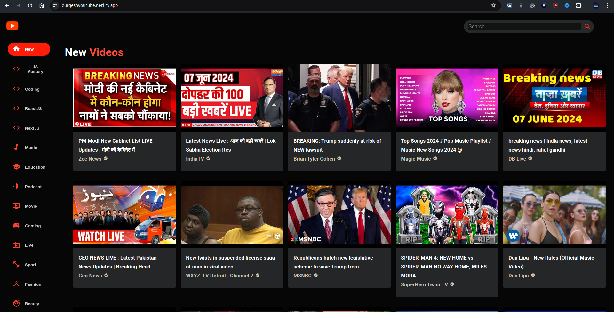
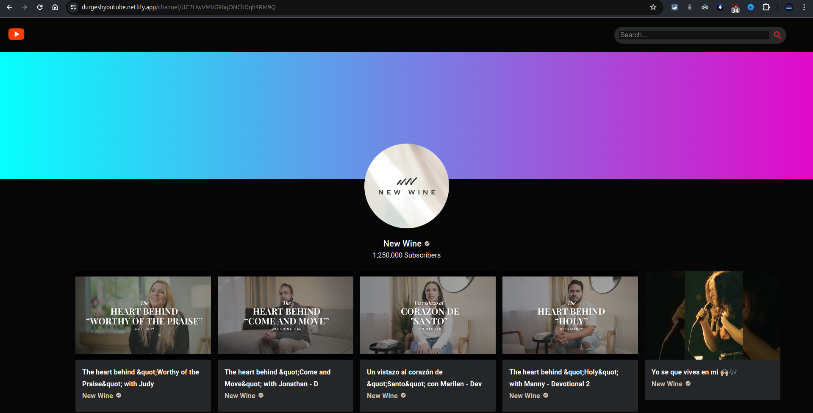

# WatchTube

## Description
WatchTube is a video explore platform enabling users to watch, search, and explore videos. The platform provides detailed video descriptions, comments, and channel information, offering a seamless user experience similar to popular video-sharing sites.Click the <a href="https://durgeshyoutube.netlify.app/">Watchtube</a> to visit site.

## Features
- **Watch Videos**: Stream videos directly on the platform.
- **Search Videos**: Find videos easily with the search functionality.
- **Explore Videos**: Discover new and trending videos.
- **Video Details**: View detailed descriptions, comments, and channel information.

## Installation
1. Clone the repository:
   ```bash
   git clone https://github.com/durgeshmehar/WatchTube.git
   cd watchtube
2. Install dependencies:
   ```bash
   npm install
3. Create a .env file in the root directory and add necessary environment variables.
4. Running Locally
      ```bash
   npm run dev
## ScreenShots
 
 

## Contributing
Feel free to submit issues or pull requests if you find any bugs or have feature suggestions.

## License
This project is licensed under the MIT License. See the LICENSE file for details.
